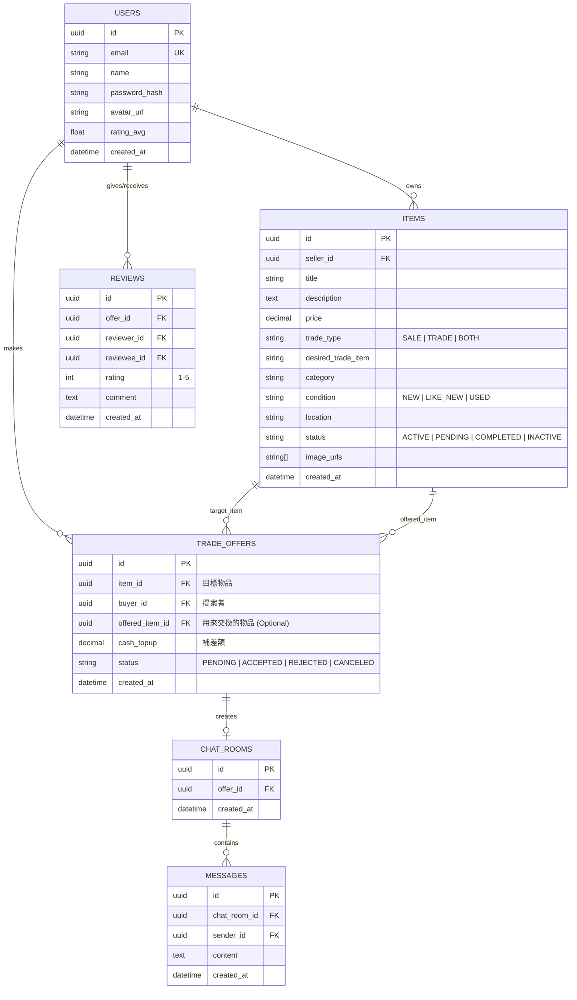

# CampusSwap

開學期間總是有物資交換的需求，整理一個好找到自己要的東西的web，同時買家也好找到自己要的東西。

<details>
<summary>第 2 週</summary>

> **核心定位：** 專為學校學生設計的校園二手物品買賣與「以物易物 (Trade/Swap)」雙軌平台。

---

## 📋 目錄
1. [專案背景與開發目標](#1-專案背景與開發目標)
2. [系統核心功能模組](#2-系統核心功能模組)
3. [技術棧選型建議 (Tech Stack)](#3-技術棧選型建議-tech-stack)
4. [資料庫架構設計 (DB Schema)](#4-資料庫架構設計-db-schema)
5. [主要 API 端點規劃 (API Specification)](#5-主要-api-端點規劃-api-specification)
6. [16 週開發時程甘特規劃 (16-Week Roadmap)](#6-16-週開發時程甘特規劃-16-week-roadmap)
7. [亮點與評分加分項目 (Key Differentiators)](#7-亮點與評分加分項目-key-differentiators)

---

## 1. 專案背景與開發目標

在開學與畢業季（宿營、搬宿舍、二手教科書買賣），學生對於二手物品交易與交換的需求極高。然而現有管道（如 FB 社團、Line 群組）常面臨以下問題：
- **資訊凌亂：** 貼文容易被刷掉，關鍵字搜尋不精準。
- **身分難以驗證：** 容易遇到校外人士，增加校園安全與交易風險。
- **缺乏交換機制：** 現有購物網站多僅支援「現金買賣」，缺乏「以物易物（補差價）」的彈性配對流程。

**CampusSwap** 旨在打造一個**高信任度、支援雙軌交易（買賣/交換）**的校園專屬 Web 平台。

---

## 2. 系統核心功能模組

### 2.1 使用者與身分驗證 (Auth & User Profile)
- **校園 Email 驗證：** 限制僅限校園 Email（如 `@mail.ncnu.edu.tw`）註冊/驗證，確保交易對象皆為校內師生。
- **信用評價機制：** 交易完成後雙方相互評分（1~5 星 + 文字評語），並於個人頁面顯示履約率與綜合評分。
- **收藏夾與管理：** 使用者可收藏感興趣的物品，並管理自己刊登中的商品。

### 2.2 物品刊登與檢索 (Item Listing & Search)
- **雙軌交易模式：**
  - **純出售 (Sale)：** 設定固定金額。
  - **純交換 (Trade)：** 設定希望換得的物品類別或描述。
  - **兩者皆可 (Both)：** 可接受現金買斷，亦可接受物品交換。
- **多條件複合篩選：** 依商品分類（教科書、宿舍家電、3C、生活用品）、新舊狀況、價格區間進行精準篩選。
- **預約面交地點：** 刊登時可選定校內常用面交地點（如：圖書館前、學生餐廳、校門口、宿舍大廳）。

### 2.3 物品交換與交易發起 (Trade & Offer Engine)
- **以物易物提案 (Trade Offer)：** 買家可選擇自己已刊登的「物品 A」作為交換籌碼，並可選擇性附加「補差額 (Cash Top-up)」。
- **提案審核流轉：** 賣家可對收到的提案選擇「接受 (Accept)」、「拒絕 (Reject)」或「取消 (Cancel)」。
- **狀態自動化控管 (State Machine)：** 
  - 刊登中 (`ACTIVE`) $\rightarrow$ 洽談中 (`PENDING`) $\rightarrow$ 已完成 (`COMPLETED`) / 已下架 (`INACTIVE`)。
  - 當某項物品的交換提案被「接受」時，該物品針對其他人的交換提案將自動轉為失效。

### 2.4 即時通訊與通知系統 (Real-time Messaging & Notifications)
- **一對一即時私訊：** 針對特定交易提案開啟聊天室，方便買賣雙方討論面交細節與細節確認。
- **站內通知中心：** 收到新提案、提案狀態更新、收到新訊息時發送即時通知。

---

## 3. 技術棧選型建議 (Tech Stack)

| 層級 | 推薦技術方案 (Modern Stack) | 備選方案 (Traditional Stack) |
| :--- | :--- | :--- |
| **前端 (Frontend)** | React / Next.js + Tailwind CSS | Vue.js 3 + Bootstrap 5 |
| **後端 (Backend)** | Node.js (Express.js / NestJS) | Python (FastAPI / Django) |
| **資料庫 (Database)** | PostgreSQL (搭配 Prisma ORM) | MySQL (搭配 Sequelize) |
| **即時通訊 (Real-time)** | Socket.IO / WebSockets | WebSocket Native |
| **檔案儲存 (Storage)** | Cloudinary / AWS S3 (商品圖片上傳) | Local File Upload (Multer) |
| **部署 (Deployment)** | Vercel (前端) + Render / Fly.io (後端) | Docker + VPS / AWS EC2 |

---

## 4. 資料庫架構設計 (DB Schema)

以 PostgreSQL 關聯式資料庫設計為例：



# W02 — Web UI and HTML

根據專案需求思考畫面設計 ()

> Prompt: 
> Use open webui style (like chatgpt) to redesign my web framework. Use the simplest HTML and CSS so that I can understand easily.
> 
> Prompt: 
> Split css from html and store in ./css so that I can keep each code file concise.

## Topics: semantic HTML tags
> 了解以下tags用法

### index.html 使用的語意化標籤

### 沒有特殊語意的標籤

- `<div>`：通用區塊容器，本身沒有特殊含義。
- `<span>`：行內容器，本身沒有特殊含義。

目前頁面沒有使用 `<nav>`。如果要明確表示側邊欄是網站導覽，可以將導覽按鈕放進 `<nav>` 裡。

### 為什麼要使用語意化標籤？

語意化標籤可以讓瀏覽器、搜尋引擎和螢幕閱讀器理解每個區域的用途。

例如：
- `<main>` 表示主要內容。
- `<aside>` 表示側邊內容。
- `<nav>` 表示導覽。
- `<form>` 表示表單。
- `<footer>`

即使不看 CSS，也能大致理解 HTML 的結構。

### Project Milestone

#### Problem
讓大家有方便交易的平台

#### Target Users
要買或賣東西的人

#### Core Features
- 可聊天，買賣方溝通。
- 上傳商品。
- 只支援面交，故無電子交易功能。

#### Data
需要哪些資料？

#### External API
是否需要API？
google 登入或手機驗證碼
#### Security / Privacy
可能有哪些風險？

#### MVP
如果只剩4週，我最少要完成哪些功能？

## W02 Learning Log


### AI Concept Question

```text
為什麼不應該整個網站全部用<div>？
請比較：
<div>
<section>
<article>
<nav>
<main>

用實際網頁例子解釋。
```

---
</details>